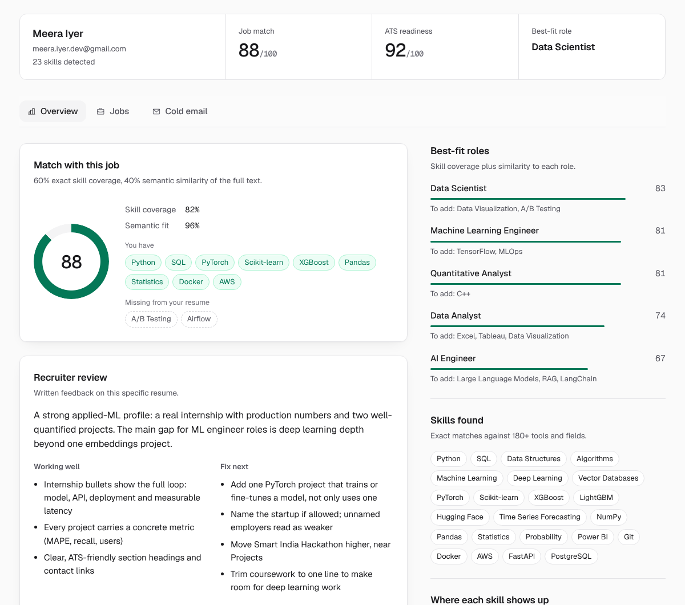
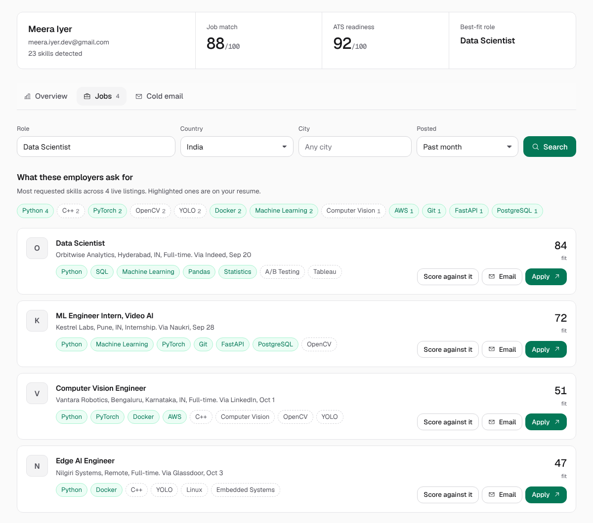
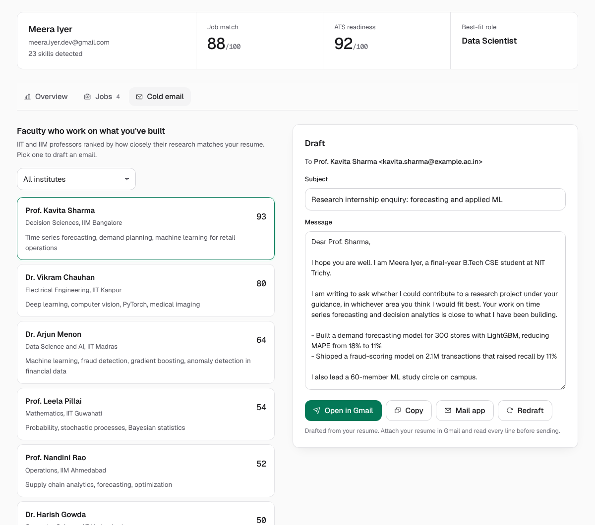

# Shortlist

Resume analysis, live job matches and cold outreach in one page. Upload a resume and Shortlist:

- **Scores it against a job**: exact skill coverage plus semantic similarity, with the missing skills listed. Paste the description, upload it as a PDF/DOCX, or paste a job link and it's scraped for you.
- **Checks ATS readiness** with deterministic rules (sections, contact details, measurable impact, length, keywords). Each failed check comes with the specific fix.
- **Writes a recruiter-style review** (LLM, via Groq) with concrete bullet rewrites.
- **Finds live openings** for your best-fit roles from LinkedIn, Indeed, Glassdoor, Naukri and company career pages (via JSearch). Each one is ranked by fit to your resume. It also shows which skills those employers ask for most, so you can see which ones you're missing.
- **Finds the recruiters** for a job: names and emails written in the JD, the company's careers page, and (optionally) its public HR emails from Hunter.io. LinkedIn searches open in your own browser; type a name you find there and it suggests their likely work email from common company formats.
- **Drafts cold emails** to those recruiters, or to 1,600+ IIT and IIM faculty whose research matches your projects. One click opens the draft in Gmail.



| Jobs | Cold email |
| --- | --- |
|  |  |

## How it works

```
resume (PDF/DOCX) ──► parse (pdfplumber / python-docx, in memory)
        │
        ├─► skills: exact match against data/skills.csv (180+ skills with aliases)
        ├─► embeddings: all-MiniLM-L6-v2 via fastembed (ONNX), resume embedded in ~60-word chunks
        │
        ├─► job match = 60% skill coverage + 40% semantic similarity
        ├─► best-fit roles = role skill coverage + similarity   (data/roles.json)
        ├─► ATS checks = deterministic rules, 100 points
        ├─► review + email drafts ─► Groq (openai/gpt-oss-120b by default)
        ├─► jobs ─► JSearch API ─► ranked by skill overlap + similarity, skill demand counted
        └─► faculty ─► professors.csv embedded once at startup, ranked by similarity + shared skills
```

| Path | What's in it |
| --- | --- |
| `app/main.py` | FastAPI routes, upload limits, rate limiting |
| `app/analysis.py` | Parsing, skill extraction, ATS checks, match score, role fit |
| `app/jobs.py` | JSearch client, skill-demand trends, job-page scraper |
| `app/outreach.py` | Faculty matching and email drafting (LLM with a template fallback) |
| `app/contacts.py` | Recruiter / HR contact finder (JD, Hunter.io, careers page, LinkedIn search links) |
| `app/llm.py` | Groq client and the review prompt |
| `frontend/` | Single page, plain HTML/CSS/JS, no build step |

## Run locally

```bash
python -m venv .venv && source .venv/bin/activate
pip install -r requirements.txt
export GROQ_API_KEY=...        # optional: written review + AI email drafts
export OPENWEBNINJA_API_KEY=... # optional: live job listings (or RAPIDAPI_KEY)
uvicorn app.main:app --reload
```

Open http://127.0.0.1:8000. The embedding model (about 90 MB) downloads on first run.

Every key is optional. Without them the app still scores resumes, still shows LinkedIn search links, and still drafts emails from a template.

## Environment variables

| Variable | Needed for | Where to get it |
| --- | --- | --- |
| `GROQ_API_KEY` | Recruiter review, personalised emails | [console.groq.com](https://console.groq.com/keys) (free tier) |
| `GROQ_MODEL` | Override the model (default `openai/gpt-oss-120b`) | [Groq models](https://console.groq.com/docs/models) |
| `OPENWEBNINJA_API_KEY` | Live job listings | Free plan on [OpenWeb Ninja](https://www.openwebninja.com/) (the JSearch provider). Results are cached for 6 hours to save quota. |
| `RAPIDAPI_KEY` | Live job listings, alternative | Use instead if you subscribe to [JSearch on RapidAPI](https://rapidapi.com/letscrape-6bRBa3QguO5/api/jsearch) |
| `HUNTER_API_KEY` | Optional: public HR emails for a company | Free plan at [hunter.io](https://hunter.io/api-keys) (needs a work or university email to sign up; about 50 searches/month; cached for 7 days). Everything else works without it. |
| `PROFESSORS_CSV` | Faculty matching | Path to the faculty CSV (see below) |

## Deploy on Render

The repo has a `Dockerfile`, so the existing Render web service keeps working:

1. Push this branch and point the service at it (or merge to `main`).
2. In **Environment**, add `GROQ_API_KEY` and `OPENWEBNINJA_API_KEY` (and `HUNTER_API_KEY` if you have one). Delete the old `TRANSFORMERS_CACHE`; nothing uses it now.
3. In **Environment > Secret Files**, add a file named `professors.csv` and set `PROFESSORS_CSV=/etc/secrets/professors.csv`.
4. Set **Health Check Path** to `/api/health`.

The image bakes in the embedding model and uses fastembed (ONNX) instead of PyTorch, which cuts memory use by several hundred MB, so it should fit the free tier's 512 MB. On the free tier, the first request after the service has been idle takes about a minute while it wakes up.

### Faculty data

`data/professors.csv` (columns `name,institute,department,interests,email`) is **gitignored on purpose**. It is a compiled directory of people's contact details. Keeping it out of the public repo, and only ever showing the top matches per resume, stops it from being scraped wholesale.

## Tests

```bash
pip install pytest && pytest -q
```

The tests use a fake embedder, so they run offline in under a second.

## Notes and limits

- Skill matching is exact (with aliases). Ambiguous words like "Excel", "React" and "Go" only match with their usual capitalisation, so "excel at" doesn't count as Excel.
- The job-link scraper reads schema.org `JobPosting` data first. That covers Greenhouse, Lever, Workday, Naukri and most career sites. LinkedIn often blocks automated reads, and when it does the app asks you to paste the description instead.
- Rate limits are per process and in memory, which is fine for a single Render instance.

Built by [Roshan Nair](https://github.com/roshannair-04).
